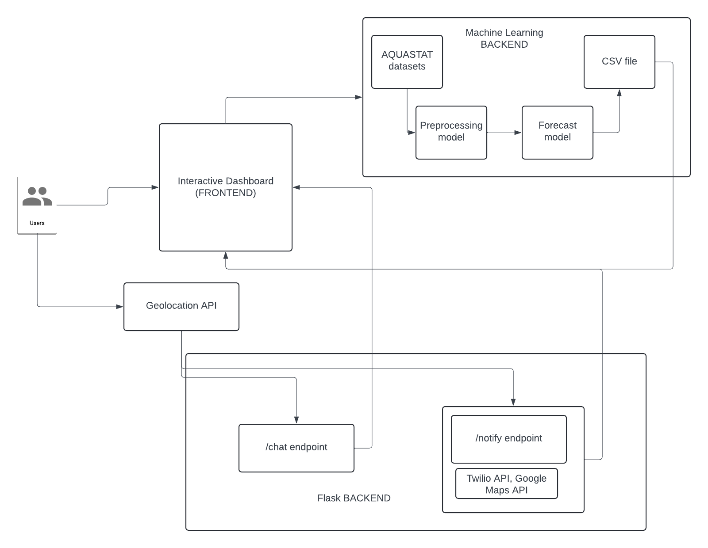

# Dropless

## Overview
This project aims to address **water scarcity**, a critical issue that causes numerous deaths due to the lack of access to renewable water resources. The dashboard provides users with tools to visualize, predict, and react to critical water-related situations.

It integrates three core features:
1. **Interactive Map**: Displays renewable water resource predictions based on the AquaSat dataset using ARIMA time series, allowing users to explore data globally.
2. **Emergency Chatbot**: Helps users find the nearest freshwater resources during emergencies.
3. **Summary Board**: Tracks weather, temperature, and predicted renewable water resources from a machine learning (ML) model, determining whether to send critical alerts to users based on specific conditions.

## Table of Contents
- [Overview](#overview)
- [Features](#features)
- [Tech Stack](#tech-stack)
- [Installation](#installation)
- [Running the Project](#running-the-project)
- [Technical Diagram](#technical-diagram)
- [License](#license)

## Features
### 1. Interactive Map
- Displays renewable water resource predictions across the globe.
- Powered by AquaSat dataset and ARIMA time series model for predicting water availability.
- Users can visualize areas with critical water scarcity.

### 2. Emergency Chatbot
- A chatbot that helps users locate the nearest freshwater resources in case of an emergency.
- Provides real-time location-based assistance.
  
### 3. Summary Board
- Tracks real-time weather and temperature data.
- Combines data from the backend ML model to predict renewable water resource availability.
- Automatically sends critical messages if water scarcity conditions are met.

## Tech Stack
### Frontend (React)
- **React** - A JavaScript library for building user interfaces.
- **Mapbox/Leaflet.js** - For creating the interactive map.
- **Axios** - For making HTTP requests to the backend.
- **React Router** - For client-side routing.
  
### Backend (Flask)
- **Flask** - A Python micro-framework to serve the backend.
- **scikit-learn / ARIMA Model** - For predicting renewable water resources.
- **Google Maps API** - Integrated with the emergency chatbot for location services.
- **Twilio** (Optional) - For sending SMS alerts in case of emergencies.

## Installation

### Prerequisites
- **Node.js** and **npm** for running the React frontend.
- **Python 3.x** for running the Flask backend.

### Frontend Setup
1. Navigate to the `frontend` folder:
    ```bash
    cd frontend
    ```
2. Install dependencies:
    ```bash
    npm install
    ```
3. Start the React development server:
    ```bash
    npm start
    ```

### Backend Setup
1. Navigate to the `backend` folder:
    ```bash
    cd backend
    ```
2. Create a virtual environment (optional):
    ```bash
    python3 -m venv venv
    source venv/bin/activate  # On Windows use `venv\Scripts\activate`
    ```
3. Install dependencies:
    ```bash
    pip install -r requirements.txt
    ```
4. Start the Flask server:
    ```bash
    flask run
    ```

### Environment Variables
- **Frontend**: Set up API keys for services like Mapbox or Google Maps.
- **Backend**: Configure ML model paths, API keys, and any necessary configurations (e.g., Twilio for SMS alerts).

## Running the Project
1. Start the **backend** server by running `flask run`.
2. Start the **frontend** by navigating to the `frontend` directory and running `npm start`.
3. Access the dashboard at `http://localhost:3000`.

## Technical Diagram
### System Architecture


## License
This project is licensed under the MIT License - see the [LICENSE](LICENSE) file for details.
